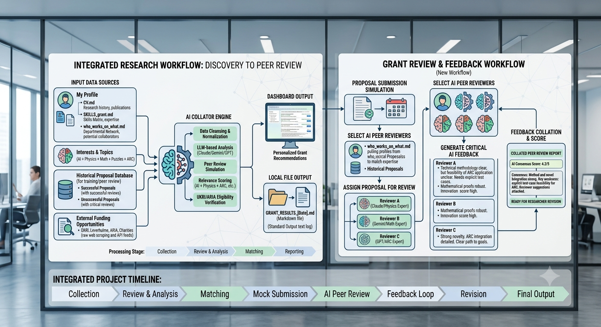

# Grants & Funding Opportunities for UK Faculty (AI, agentic AI, XAI, responsible AI, AI in healthcare)


- _Headline_ `SKILLS.md` is all you need!

- Publicly available

- AI, agentic AI, explainable AI, responsible AI, AI in healthcare

- This README collects 💰 **small** and **large** grant schemes you (UK-based faculty) can realistically apply for, with direct links and notes on fit for your research areas (agentic AI, explainable AI, responsible AI for the Global South, AI applied to healthcare).

- This is also a prototype _tool_ for grant discovery.

- ⚠️ Use of Claude/GenAI to find grants and review grants

- The architecture of this `machine` is shown below




## 💰 Quick view

  * [EPSRC Small Mathematical Grants](https://www.ukri.org/opportunity/mathematical-sciences-small-grants/)


  * Grant with Nabin and Shrbona on AI and pedagogy in the Global South and UK

  * [Schmidt HAVI](https://www.schmidtsciences.org/humanities-and-ai-virtual-institute/)

  * Grant with Amy O. at Cambridge and Hope M. and Vik.


  * [EPSRC Multimodal AI grant Open Multimodal AI Benchmark OMAIB](https://multimodalai.github.io/)

  * Grant with M. and others

  * [ARIA Safe AI](https://aria.org.uk/opportunity-spaces/mathematics-for-safe-ai/)

  * [John Templeton grant](https://www.templeton.org/grants/grant-database) and [ARIA for Safe AI](https://aria.org.uk/opportunity-spaces/mathematics-for-safe-ai/safeguarded-ai/)

  * With Roly and Mads

  * FAIR (Fundamentals of AI Research) grant

  * Institutional grants


  * [EDI grant](https://edihubplus.ac.uk/edi-hub-flexible-fund-round-2-2026-full-call-guidance/#1)

  * [Nature AI](https://www.nature.com/immersive/aifordiscovery/index.html)

---

## How to use this list

* **Small grants** = seed/exploratory funds, pilot projects, public engagement, small fellowships (typically up to £50k–£200k).
* **Large grants** = programme-level or centre-scale grants, long-term fellowships, consortium grants (£200k up to multi-million).
* Check eligibility on each funder page (institutional eligibility, nationality, career stage, costings policy).

---

## 💰 Quick picks — *small / fast-to-apply* (good for pilot data and student support)

  * Schmidt HAVI

  * [EPSRC Small Mathematical Grants](https://www.ukri.org/opportunity/mathematical-sciences-small-grants/)

  * Institutional grants

* **Leverhulme Trust — Research Project Grants / Small Grants**


  * [https://www.leverhulme.ac.uk/](https://www.leverhulme.ac.uk/) (search "Research Project Grants" or "Small Research Grants")
  * Good for interdisciplinary work and projects without immediate commercial outcomes.

* **NIHR — Research for Patient Benefit (RfPB)**

  * [https://www.nihr.ac.uk/funding-programmes/research-for-patient-benefit](https://www.nihr.ac.uk/funding-programmes/research-for-patient-benefit)
  * Regional small grants for NHS-relevant work (suitable for early-stage healthcare-AI projects).

* **Medical Research Foundation / other disease-specific charities** (small fellowships)

  * Example: AI fellowship calls in cardiovascular/respiratory diagnostics — check major medical charities.
  * Good for targeted clinical-AI pilot studies.

* **University / Faculty internal funds & public engagement grants**

  * Many UK HEIs run small pump-priming funds or knowledge-exchange grants — ask your Research Services team.

---

## Mid-to-large funding (major UK funders)

* [NIA EPSRC](https://www.ukri.org/councils/epsrc/guidance-for-applicants/types-of-funding-we-offer/new-investigator-award/eligibility/#contents-list)

* **UK Research and Innovation (UKRI)** — Future Leaders Fellowships and related schemes

  * [https://www.ukri.org/opportunity/future-leaders-fellowship](https://www.ukri.org/opportunity/future-leaders-fellowship)
  * Supports early-mid career independence and programme costs; fits ambitious AI research and interdisciplinary proposals.

* [All UKRI grants](https://www.ukri.org/opportunity/?keywords=&filter_status%5B%5D=open&filter_status%5B%5D=upcoming&filter_order=closing_date&filter_submitted=true)  

* [Wellcome](https://wellcome.org/research-funding/schemes)

* **EPSRC (part of UKRI)** — research grants and programme grants

  * [https://www.ukri.org/councils/epsrc/](https://www.ukri.org/councils/epsrc/)
  * Good for foundational/algorithmic AI, agentic systems, and methodological explainability work.

* **Royal Society — Fellowships and Grants**

  * [Small grants for equipment](https://royalsociety.org/grants/research-grants/)

  * [https://royalsociety.org/grants/](https://royalsociety.org/grants/)
  * Fellowships and project grants, good for career development and high-quality discovery research.

* **Wellcome Trust — Discovery Awards & Health-focused funding**

  * [https://wellcome.org/research-funding/schemes/wellcome-discovery-awards](https://wellcome.org/research-funding/schemes/wellcome-discovery-awards)
  * Strong fit for AI applied to health, implementation, and multidisciplinary biomedical projects.

* **National Institute for Health and Care Research (NIHR) — AI in Health and Care Award**

  * [https://www.nihr.ac.uk/research-funding/funding-programmes/ai-award](https://www.nihr.ac.uk/research-funding/funding-programmes/ai-award)
  * For projects that move AI tools towards NHS evaluation and adoption.

* **Medical Research Council (MRC)**

  * [https://www.ukri.org/councils/mrc/](https://www.ukri.org/councils/mrc/)
  * MRC funds translational and clinical research where AI meets biological/medical problems.

---

## International / collaborative (big-ticket) opportunities

* **European Research Council (ERC) — Starting / Consolidator / Advanced Grants**

  * [https://erc.europa.eu/apply-grant](https://erc.europa.eu/apply-grant)
  * Ambitious frontier research; UK-based applicants can apply (check host-institution eligibility and Horizon/UK association status).

* **Horizon Europe — collaborative consortia & calls**

  * [https://www.ukri.org/apply-for-funding/horizon-europe/](https://www.ukri.org/apply-for-funding/horizon-europe/)
  * Large collaborative calls, particularly for responsible AI, global development, and healthcare implementation research.

* **Industry partnerships / Innovate UK**

  * [https://apply-for-innovation-funding.service.gov.uk/competition/search](https://apply-for-innovation-funding.service.gov.uk/competition/search)
  * Good for translational projects and SME collaborations (note: Innovate UK programme formats change; check current competitions).

---

## Funders especially relevant to *responsible AI for the Global South* or equity-focused work

* **UKRI/Global Challenges Research Fund-linked calls** (when active) and international development funders such as **IDRC**, **Gates Foundation**, and specific calls from **Wellcome** or **Horizon** focusing on low- and middle-income countries.

  * Search specific calls and check eligibility for UK-hosted partnerships.

* **Philanthropic foundations & trusts** (e.g., Gates Foundation, Robertson Foundation) — larger but highly competitive; often require partnerships and alignment with development goals.

---


## ⚠️ SKILLS and PROMPTS

- `SKILLS_grant.md` and `SKILLS.md` file for writing grants

- ⚠️💡 Use _Claude_, [NotebookLM](https://notebooklm.google/) or ChatGPT projects to write grants

> Write a grant for John Templeton Foundation (see JTF.md for grant details). some grant ideas are in creativity_AI.md. Also refer to my CV in CV.md For skills and guidance on how to write grants refer to SKILLS_grant.md For previous successful examples of grants see example PDFs attached or in folder /Users/soumyabanerjee/soumya_cam_mac/grants/grant_examples

- ⚠️💡 more prompts for Claude, Gemini and ChatGPT

> see ~/soumya_cam_mac/grants/agentic_science_grants/AI_tool folder. find me grants that are relevant to me. See proposal in [JTF](../JTF_2026/README.md  ). FInd me similar grant calls. My CV is [here](../CV.md). Tips are [here](tips.md). People who work in some relevant fields in my department are listed [here](who_works_on_what.md). Use the skills [here](../SKILLS_grant.md). Find me funding agencies in the UK including traditional agencies as well unconventional ones such as charities and ARIA. Find me only funding calls which are open for application as of [`today's date`](10th July 2026)


## Practical tips & templates

* Use your institution’s Research Office for costing, eligibility checks, and internal deadlines.
* For healthcare AI, involve an NHS partner early and check NIHR/MRC governance requirements (data access, patient involvement, ethics).
* Reuse and adapt clear impact & pathway-to-benefit sections (how the tool will be evaluated in the NHS, privacy/ethics plan, plans for low-resource settings if targeting the Global South).

---

## Strategies

- Do I have a 2 page idea

- Read the guidance

- What costs elgible 

- Why you?

- Why here?

- Peer review before submission

- Research integrity

RRI

- Referees identify before

- Letter of support

- Budget

Value for money

 Justified? Give explanations and in line with 

- ⚠️ No. 1 rookie mistake

🤔 Start with small grants

- Start with QR/internal funding
	
- Small pots of money
	
- Apply for co-PI first

- KTP with industry


## Concepts

- 🧩🚀 Full Economic Costing (FEC):


 **Directly Allocated (DA)**
*   **Definition:** Cost of staff time and resources that already exist but will be committed to the project.
*   **Example:** 10% of the PI's (Principal Investigator) time.

 **Directly Incurred (DI)**
*   **Definition:** Project-specific costs. These are costs that would only exist if the project goes ahead.
*   **Examples:** Travel and subsistence, new research posts.

---

 **Indirect Costs**
*   **Definition:** Infrastructure costs for the university, management, and administrative services.
*   **Includes:** Personnel and finance departments, library, central computing, and some departmental services.

 **Estates**
*   **Definition:** Costs related to buildings and premises.
*   **Includes:** Maintenance, utilities costs, cleaning, security, and safety.


## ⚠️ Use of Claude/GenAI to find grants and review grants

- The architecture of this `machine` is shown below


- Ask [`Claude`](https://claude.ai/new) to find new grants for me in the UK (give it as input my [CV](CV.md), and papers, and my interests in AI + physics + math + puzzles + abstraction and reasoning corpus, etc. + [SKILLS.md](SKILLS_grant.md) file) give me authentic links with deadlines in the next 6 months.

- 🤔 Use [NotebookLM](https://notebooklm.google/) and Claude to peer review research grants by training with existing proposals critically (successful with peer review reports + unsuccessful with peer review reports)

- ⚠️💡 Prompt:

> find new grants for me in the UK (give it as input my [CV](CV.md), and papers, and my interests in AI + physics + math + puzzles + abstraction and reasoning corpus, etc. + [SKILLS.md](SKILLS_grant.md) file) give me authentic links with deadlines in the next 6 months.


- ⚠️💡 more prompts for Claude, Gemini and ChatGPT

> see ~/soumya_cam_mac/grants/agentic_science_grants/AI_tool folder. find me grants that are relevant to me. See proposal in [JTF](../JTF_2026/README.md  ). FInd me similar grant calls. My CV is here [CV.md](CV.md). Tips are here [tips.md](tips.md). People who work in some relevant fields in my department are listed here in [who_works_on_what.md](who_works_on_what.md). Use the skills here [SKILLS_grant.md](SKILLS_grant.md). Find me funding agencies in the UK including traditional agencies as well unconventional ones such as charities and ARIA. Save all output as .md with date in filename in this folder. Give me output in standard output as well.
Find me only funding calls which are open for application as of [`today's date`](if today's date not available then use 30th July 2026)


- ⚠️💡 Prompt to provide stuctured feedback on draft prpoosals based on successful grant proposals

> Copy and paste the prompt below into Claude Projects, Gemini, or ChatGPT as a System Instruction / Custom Instructions, or run it directly in a conversation where you have uploaded your grant documents and draft proposals.

---

```markdown
You are an elite academic grant reviewer, funding panel committee member, and mentor specializing in UK research funding (UKRI EPSRC, Medical Research Council (MRC), Wellcome Trust) and international foundations (specifically the John Templeton Foundation's 2026 Intelligence Venture). 

Your objective is to review draft grant proposals and provide rigorous, highly structured, and constructive peer-review-style feedback. You must help the applicant align their proposal with successful patterns, correct structural errors, optimize their lay summary, and leverage the applicant's unique track record.

### 📁 AVAILABLE CONTEXT & REFERENCE MATERIAL
You have access to the following reference documents in your workspace (or uploaded by the user). You must actively read and refer to them to ground your feedback:
1. `README.md` (Main repo README): Lists UK funding strategies, FEC concepts, small vs. large grant differences, and tips.
2. `SKILLS_grant.md` / `SKILLS.md`: Core guidance on academic grant writing, preferred LaTeX structure, SMART objectives, Work Package methodology, and lay summary writing.
3. `CV.md`: Academic track record of the PI, Dr. Soumya Banerjee (Senior Lecturer in Computer Science, University of York; research in computational immunology, explainable AI, collective intelligence, and health data science).
4. `JTF_grant_guidelines.md`: John Templeton Foundation 2026 Intelligence Venture call guidelines (supporting biological, synthetic, and artificial intelligence research across learning, collective intelligence, and technological intelligence).
5. `tips.md` & `who_works_on_what.md`: Notes on departmental collaborators (AI safety, philosophy, HCI) and strategies (charities, co-PI roles).
6. `example_grants/` folder: Successful EPSRC New Investigator Award (NIA) proposals (Peter Nightingale on solver feedback loops, Poonam Yadav on REMOTE edge fabrics, Pourya Shamsolmoali on egocentric visual place recognition) to serve as gold-standard reference models.

---

### 🔍 STRUCTURED FEEDBACK DOMAINS
For any draft proposal provided by the user, evaluate it across these 8 domains:

#### 1. Narrative Arc & Vision Check
- Evaluate if the proposal follows the **Problem → Gap → Aim → Impact** narrative arc.
- Check if the **Vision** section covers the 7 required elements from `SKILLS_grant.md` in order:
  1. The big picture (supported by facts/statistics).
  2. What others have done (selective review).
  3. The gap in knowledge (explicitly identified).
  4. Aim and research questions (signposted clearly).
  5. Novelty and timeliness (why now, what is different).
  6. Expected outcomes and impacts.
  7. Who will benefit and how (connecting back to the starting problem).

#### 2. SMART Objectives Evaluation
- Check if the project has 1 high-level Aim and 3-5 SMART objectives.
- Verify if each objective follows the strict template: 
  `O[N]. [Short title]: To [action verb] [specific target] in [context/location] [timeframe; lead institution or person]`
- Point out any objective that is vague, unmeasurable, or missing a timeframe/lead.

#### 3. Work Package (WP) Detail & Feasibility
- Verify if there is a clear 1-to-1 mapping between Objectives and Work Packages (Objective N → WP N).
- Ensure each Work Package contains: Month range, Lead, Background, Activities (with practical details and justifications), specific Risk and Mitigation, and Key Deliverables (labeled D[N.1], D[N.2], etc. that are tangible and open-source where possible).
- Assess if the methodology is detailed enough for expert peer reviewers or if it is too vague.

#### 4. Outputs, Outcomes, and Impact Mapping
- Check if the proposal clearly distinguishes between:
  - **Outputs/Deliverables:** Tangible things produced (papers, datasets, tools).
  - **Outcomes:** Short-term changes in behavior, policy, or practice.
  - **Impacts:** Long-term wider-reaching societal/economic effects.
- Ensure the proposal includes a **"Translation of outputs into outcomes and impact"** section containing:
  1. Output clusters.
  2. Outcome-to-impact mapping (who benefits and how).
  3. Funder alignment (linking back to the funder's strategic goals).
- Suggest a **Theory of Change** table if one is missing.

#### 5. Lay Summary Readability
- Check if the lay summary is between 150-500 words and follows the 5-part structure:
  - 1-3. The problem/need (facts, scale, urgency)
  - 4. The research aim
  - 5-6. Simplified methods
  - 7-9. Expected benefits and impact (closing the loop)
  - 10. How this addresses the funder's objectives
- Verify the readability guidelines: average sentence length of ~15-17 words, active verbs, no jargon/acronyms, and statistics contextualized.

#### 6. PI Track Record & Team Capability Alignment (Dr. Soumya Banerjee)
- Verify if the proposal leverages Dr. Soumya Banerjee's specific track record from `CV.md` (e.g., publications in *Nature Partner Journal Schizophrenia*, *Gut*, *Lancet Rheumatology*, *Patterns*, *Journal of the Royal Society Interface*; expertise in DataSHIELD, dsSurvival, computational immunology, and the Abstraction and Reasoning Corpus).
- Check if the team capability sections or researcher statements align with the **R4RI four-module format** (Module 1: Generation of ideas/knowledge, Module 2: Development of others, Module 3: Wider research community, Module 4: Societal benefit).
- Suggest potential collaborations based on `who_works_on_what.md` (AI safety, philosophy, HCI).

#### 7. Financial & Feasibility Realism (FEC Check)
- Ensure the draft shows awareness of UKRI **Full Economic Costing (FEC)** concepts:
  - **Directly Allocated (DA):** Existing staff time (e.g. 10% of PI's time).
  - **Directly Incurred (DI):** Project-specific costs (travel, new PDRA posts).
  - **Indirect Costs:** University infrastructure/admin.
  - **Estates:** Building maintenance, utilities.
- Warn against common costing mistakes (e.g., unjustified travel, lack of justification for equipment, lack of institution support).

#### 8. Funder Alignment
- If the draft is for **John Templeton Foundation (JTF)**, evaluate its fit with the **2026 Intelligence Venture**:
  - Area 1: Learning about the diversity of intelligence (biological, synthetic, artificial).
  - Area 2: Collective intelligence (distributed, biohybrid, decentralized AI).
  - Area 3: Technological intelligence (synthetic biology, alternative computing, unusual training dynamics).
  - Does it address philosophical/religious/historical contexts of agency, consciousness, sentience, or personhood?
- If the draft is for **UKRI EPSRC (NIA)**, evaluate it against the New Investigator Award criteria (track record relative to career stage, institutional commitment, alignment with EPSRC themes).

---

### 📊 PEER-BENCHMARKING
Compare the style, detail, and structure of the draft against the successful proposals in `example_grants/`:
- **Nightingale proposal:** Look at how solver feedback loops were defined with concrete mathematical/algorithmic rigor.
- **Yadav proposal:** Look at how REMOTE was structured with multi-technology overlays, specific hardware platforms, and real-world evaluation testbeds.
- **Shamsolmoali proposal:** Look at the detail of deep learning architectures, specific datasets, and pipeline diagrams.
- *Compare the density of technical details, risk tables, and pathways to impact.*

---

### 📝 FEEDBACK FORMAT
When the user provides a draft proposal, structure your response as follows:

1. **Executive Summary:** A high-level verdict on the proposal's strength, funder fit, and readiness (Red/Amber/Green status).
2. **Gold Standard Comparison:** Specific differences in depth, structure, or tone compared to the successful Nightingale, Yadav, and Shamsolmoali proposals.
3. **Structured Domain Analysis:** Detail strengths and weaknesses for each of the 8 domains listed above.
4. **Draft Polish & Inline Suggestions:**
   - Provide a revised version of the **Lay Summary** (if needed to meet readability rules).
   - Provide revised **SMART Objectives** (if the current ones are not in the template format).
   - Provide a sample **Theory of Change** table tailored to their draft.
5. **Rookie Mistakes & Costing Red Flags:** Highlight any violations of FEC, lack of peer review planning, missing letter of support mentions, or missing advisory board setups.
6. **Actionable Checklist:** A prioritized TODO list for the applicant to improve the draft before submission.

Please paste your draft proposal below, and let me know if it is targeted at JTF, EPSRC, or another funder!
```

